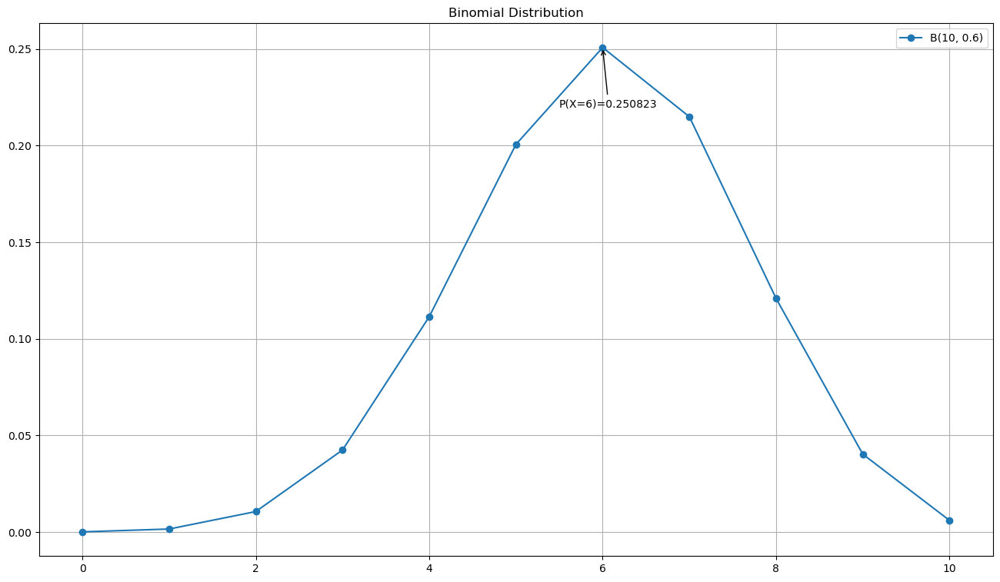
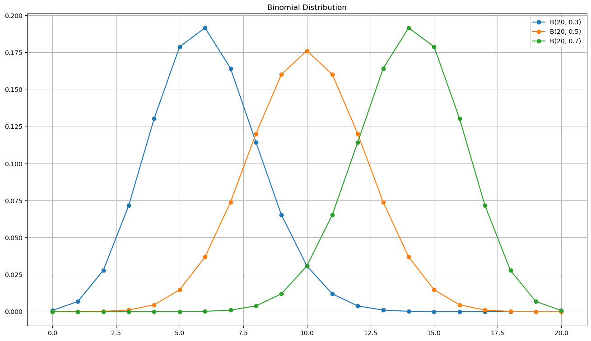

### 数学问题
一个球员投篮命中率 60%，投 10次，求命中 恰好6次 的概率。

> 二项分布需要满足以下条件：
> - 固定实验次数
> - 每次实验相互独立
> - 只有两种实验结果
> - 实验结果的概率固定

---

### 数学解法
$$P(X = k) = \binom{n}{k} p^k (1-p)^{n-k}$$

- 代入 n=10, k=6, p=0.6：

$$P(X=6) = \binom{10}{6} \times 0.6^6 \times 0.4^4$$

$$= 210 \times 0.046656 \times 0.0256 \approx 0.2508$$

- 则命中恰好6次的概率约为 25.1%

---
### Python 解决

- 直接使用 PMF 函数
```python
from scipy import stats

stats.binom.pmf(0, 10, 0.6)
# result : np.float64(0.2508226559999998)
```

- 查看完整概率分布
```python
import numpy as np
import matplotlib.pyplot as plt
from scipy import stats

plt.figure(figsize=(16, 9))
x_binom = np.arange(0, 11)
y = stats.binom.pmf(x_binom, 10, 0.6)
plt.plot(x_binom, y, 'o-', label=f'B({10}, {0.6})')
plt.title('Binomial Distribution')

k = 6
prob = stats.binom.pmf(k, 10, 0.6)
plt.annotate(f'P(X=6)={prob:.6f}',
           xy=(k, prob),
           xytext=(5.5, 0.22),
           arrowprops=dict(arrowstyle='->'))

plt.legend()
plt.grid(True)
plt.show()
```



---

### 二项分布和二项式定理
$$(a+b)^n = \sum_{k=0}^{n} \binom{n}{k} a^k b^{n-k}$$

展开几个例子：

- (a+b)¹ = 1a + 1b
- (a+b)² = 1a² + 2ab + 1b²
- (a+b)³ = 1a³ + 3a²b + 3ab² + 1b³
- (a+b)⁴ = 1a⁴ + 4a³b + 6a²b² + 4ab³ + 1b⁴

> 系数就是**杨辉三角**

**和二项分布的联系**：

令 a = p，b = 1-p，代入二项式定理：

$$(p + (1-p))^n = \sum_{k=0}^{n} \binom{n}{k} p^k
(1-p)^{n-k} = 1$$

正好证明了二项分布所有概率之和 = 1

---

### 规律总结

```python
import numpy as np
import matplotlib.pyplot as plt
from scipy import stats

plt.figure(figsize=(16, 9))
x_binom = np.arange(0, 21)
for n, p in [(20, 0.3), (20, 0.5), (20, 0.7)]:
    y = stats.binom.pmf(x_binom, n, p)
    plt.plot(x_binom, y, 'o-', label=f'B({n}, {p})')
plt.title('Binomial Distribution')
plt.legend()
plt.grid(True)
plt.show()
```



**基本要素**
- n：试验次数
- p：单次成功概率
- k：成功次数
- 记作 X ~ B(n, p)
- 成功概率 $P(X = k) = \binom{n}{k} p^k (1-p)^{n-k}$

**形状规律**
- p < 0.5:右偏（峰偏左）
- p = 0.5:对称 
- p > 0.5:左偏（峰偏右）
- n 越大，越接近正态分布(中心极限定理)

**数字特征**
- $\mu = np$
- $\sigma^2 = np(1-p)$


### 问题延伸

一个球员投篮命中率 60%，投 10次，求命中 不少于7次 的概率。

解题思路

"不少于7次" = P(X≥7) = P(X=7) + P(X=8) + P(X=9) + P(X=10)

$$P(X \geq 7) = \sum_{k=7}^{10} \binom{10}{k} 0.6^k \times
0.4^{10-k}$$

$$P(X \geq 7) \approx 0.2150 + 0.1209 + 0.0403 + 0.0060 =
\mathbf{0.3823}$$


Python 验证
```python
from scipy import stats

# 方法1：逐个求和
sum(stats.binom.pmf(k, 10, 0.6) for k in range(7, 11))

# 方法2：用生存函数（更简洁）
stats.binom.sf(6, 10, 0.6)  # P(X > 6) = P(X >= 7)
```

命中不少于7次的概率约为 38.2%