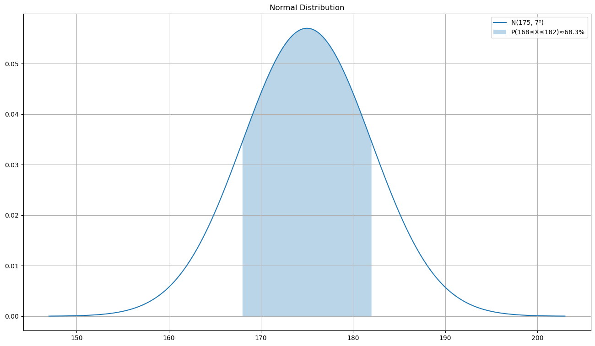
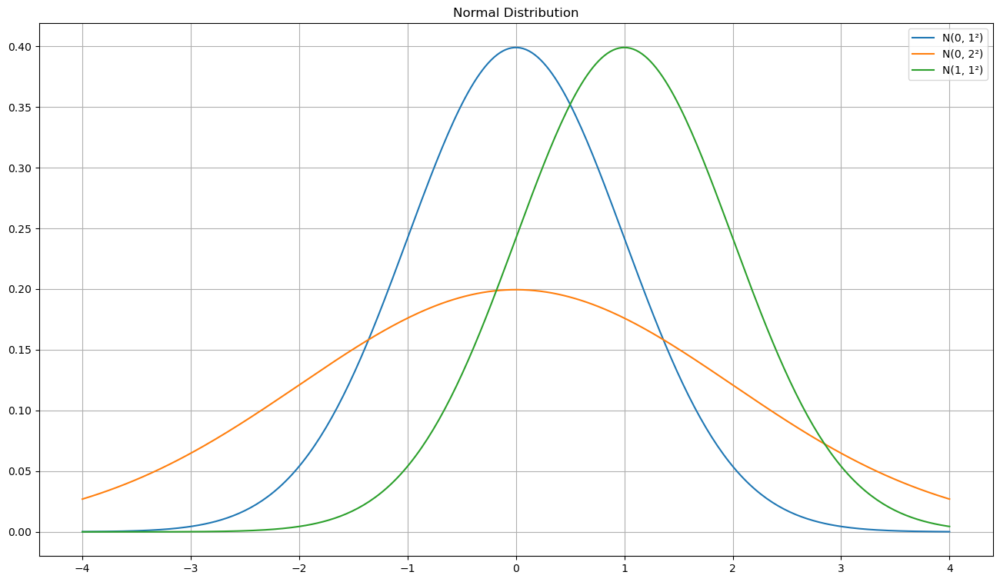

### 数学问题

某地区成年男性身高服从正态分布，均值 μ=175cm，标准差 σ=7cm，求随机抽取一人身高在 168cm 到 182cm 之间的概率。

> 正态分布需要满足以下条件：
> - 数据关于均值对称
> - 均值附近的概率最大
> - 远离均值的概率趋近于 0
> - 由 μ 和 σ 完全确定

---

### 数学解法

$$f(x) = \frac{1}{\sigma\sqrt{2\pi}} e^{-\frac{(x-\mu)^2}{2\sigma^2}}$$

- 代入 μ=175, σ=7，求 P(168 ≤ X ≤ 182)：

$$P(168 \leq X \leq 182) = \int_{168}^{182} f(x)\,dx$$

- 标准化（Z-score）：

$$Z = \frac{X - \mu}{\sigma} = \frac{168-175}{7} = -1, \quad \frac{182-175}{7} = 1$$

$$P(-1 \leq Z \leq 1) \approx 0.6827$$

- 则身高在 168~182cm 之间的概率约为 **68.3%**

---

### Python 解决

- 直接使用 PDF / CDF 函数
```python
from scipy import stats

# CDF：P(X ≤ x)
stats.norm.cdf(182, loc=175, scale=7) - stats.norm.cdf(168, loc=175, scale=7)
# result : 0.6826894921370859
```

- 查看完整概率分布
```python
import numpy as np
import matplotlib.pyplot as plt
from scipy import stats

plt.figure(figsize=(16, 9))
x = np.linspace(147, 203, 300)
y = stats.norm.pdf(x, loc=175, scale=7)
plt.plot(x, y, label='N(175, 7²)')

# 标注区间
x_fill = np.linspace(168, 182, 300)
y_fill = stats.norm.pdf(x_fill, loc=175, scale=7)
plt.fill_between(x_fill, y_fill, alpha=0.3, label='P(168≤X≤182)≈68.3%')

plt.title('Normal Distribution')
plt.legend()
plt.grid(True)
plt.show()
```


---

### 正态分布与标准正态分布

任意正态分布 X ~ N(μ, σ²) 可通过 **Z-score 标准化**转为标准正态分布 Z ~ N(0, 1)：

$$Z = \frac{X - \mu}{\sigma}$$

**标准正态分布的 PDF：**

$$\phi(z) = \frac{1}{\sqrt{2\pi}} e^{-\frac{z^2}{2}}$$

---

### 规律总结

```python
import numpy as np
import matplotlib.pyplot as plt
from scipy import stats

plt.figure(figsize=(16, 9))
x = np.linspace(-4, 4, 300)
for mu, sigma in [(0, 1), (0, 2), (1, 1)]:
    y = stats.norm.pdf(x, loc=mu, scale=sigma)
    plt.plot(x, y, label=f'N({mu}, {sigma}²)')
plt.title('Normal Distribution')
plt.legend()
plt.grid(True)
plt.show()
```



**基本要素**
- μ：均值（控制位置）
- σ：标准差（控制宽窄）
- 记作 X ~ N(μ, σ²)
- PDF: $f(x) = \frac{1}{\sigma\sqrt{2\pi}} e^{-\frac{(x-\mu)^2}{2\sigma^2}}$

**形状规律**
- 关于 μ 完全对称
- σ 越小，曲线越高越窄
- σ 越大，曲线越低越宽
- 两端无限延伸，趋近于 0

**经验法则（68-95-99.7 法则）**
- $P(\mu - \sigma \leq X \leq \mu + \sigma) \approx 68.3\%$
- $P(\mu - 2\sigma \leq X \leq \mu + 2\sigma) \approx 95.4\%$
- $P(\mu - 3\sigma \leq X \leq \mu + 3\sigma) \approx 99.7\%$

**数字特征**
- $\mu$：均值 = 中位数 = 众数
- $\sigma^2$：方差

---

### 问题延伸

同一地区，求随机抽取一人身高**超过 189cm** 的概率。

解题思路

"超过 189cm" = P(X > 189) = 1 - P(X ≤ 189) = SF(189)

$$Z = \frac{189 - 175}{7} = 2$$

$$P(X > 189) = P(Z > 2) \approx 1 - 0.9772 = \mathbf{0.0228}$$

Python 验证
```python
from scipy import stats

# 方法1：1 - CDF
1 - stats.norm.cdf(189, loc=175, scale=7)

# 方法2：用生存函数（更简洁）
stats.norm.sf(189, loc=175, scale=7)  # P(X > 189)
```

身高超过 189cm 的概率约为 2.3%
